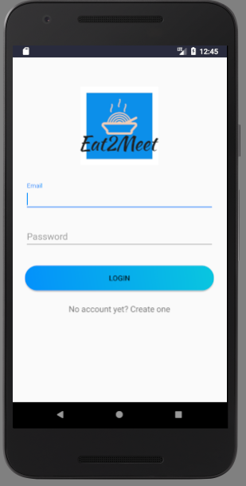
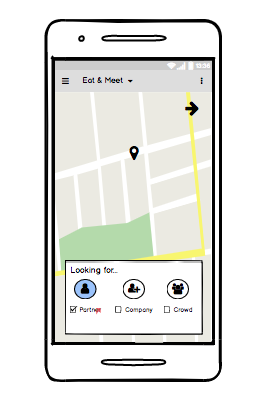
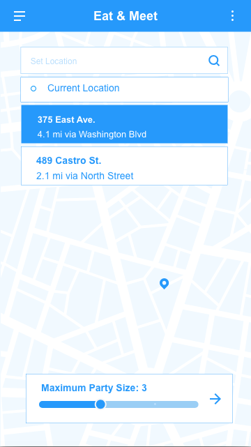
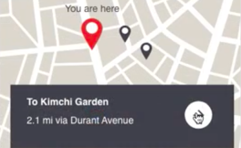
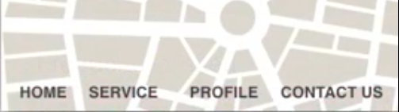
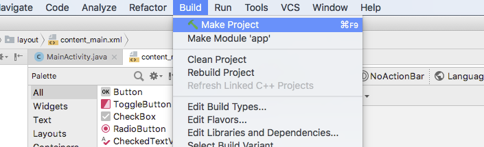
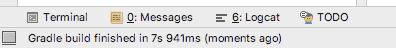
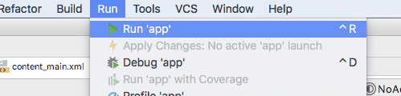

# __Eat2Meet__: Why just eat when you can __Eat2Meet__?

## Overview

__Eat2Meet__ is an Android Application designed to help you find friends in cities that you may be new to! We match you with others who __share your general dining preferences__ and let you take it from there in our __custom chat-rooms__. If you are hesitant to meet complete strangers, we also allow you to find and __chat with friends-of-friends__ through our social-circle features.

Above is the __Eat2Meet__ login page. Notice that the user interface conforms to _Android UI application conventions_ so that users can enjoy _effective, streamlined experiences_.

## Motivation

We have gone through quite a few iterations of our design, including a major conceptual pivot. We initially developed an application, __PeopleMates__, which would help customers consolidate to-go orders but we found that the user group we decided on was too broad and the application lacked an element of social impact. We settled on __Eat2Meet__, an app that provides a unique and supportive space for people new to a neighborhood, city, etc.

Simple initial design of the __Eat2Meet__ matching page.

Low-Fi prototype additions include a new map background and preferences menu.

Hi-Fi prototype still consists of map background with added current location settings and a more refined preferences menu.

The original map design from __Peoplemates__.

The original toolbar design from __Peoplemates__.

## About __Eat2Meet__

__Eat2Meet__ matches users based on their __dining preferences and social circles__ (determined by users at sign-in). In addition, this app allow users to find other Eat2Meeters nearby if location and timing are concerns. In the future, we plan on integrating the [_Google Maps API_](https://cloud.google.com/maps-platform/) in order to make finding locations easier. We also plan on adding features that allow the user to link their account to [_Facebook_](https://developers.facebook.com/) so that populating social-circles is more convenient.

## Installation

Be sure to first [_download_](https://developer.android.com/studio/index.html) and [_install_](https://developer.android.com/studio/install) [__Android Studio__](https://developer.android.com/studio/).

Once you have done so, you can clone or download this repo and open it in __Android Studio__.

### Building the App

Build the project by clicking __Build > Make Project__

After a short while, you should see a notification that the build finished

### Running the App

If you have an Android device, you can connect your device to __Android Studio__ and run the app on your device. If not, you can run the app in an emulator.

To run the app, click __Run > Run App__

After doing so, you can choose to run it on your device or on an emulator.

## About Us

__Eat2Meet__ was created for [UC Berkeley's](https://www.berkeley.edu/) Fall 2018 [CS160 class](https://inst.eecs.berkeley.edu/~cs160/archives.html) (Project Team I). The creators of this project are [Ilina Bhaya-Grossman](https://github.com/ilinabg), [Yumeng Ge](https://github.com/yumengge), [Rishi Satoor](https://github.com/rsatoor), and [Jonathan Sun](https://github.com/jonathansun5).
